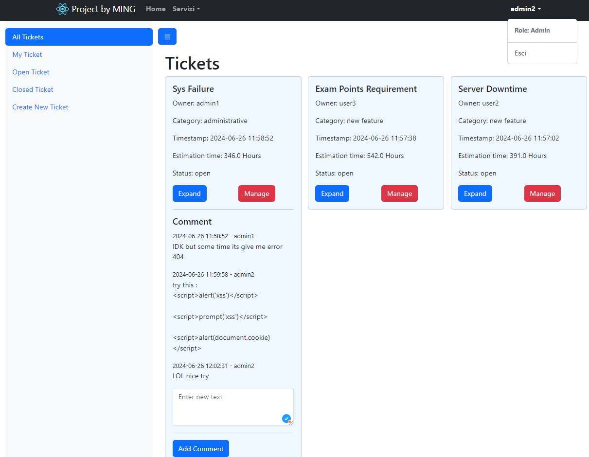
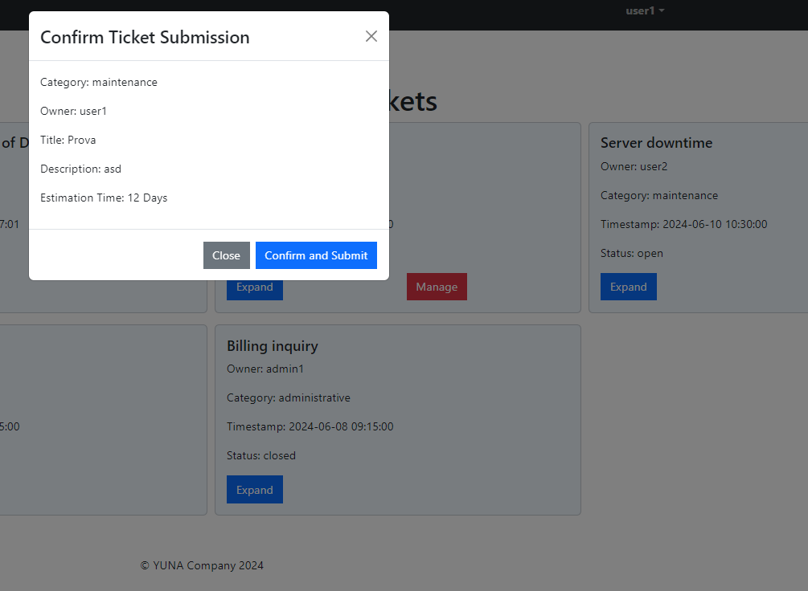

## Table of Contents

1. [React Client Application Routes](#react-client-application-routes)
2. [API Server](#api-server)
    1. [Authentication](#authentication)
        - [POST /api/sessions](#post-apisessions)
        - [GET /api/sessions/current](#get-apisessionscurrent)
        - [DELETE /api/sessions/current](#delete-apisessionscurrent)
    2. [JWT Token](#jwt-token)
        - [POST /api/auth-token](#post-apiauth-token)
    3. [Content Management](#content-management)
        - [POST /api/createtickets](#post-apicreatetickets)
        - [POST /api/createblock](#post-apicreateblock)
        - [POST /api/manageblock](#post-apimanageblock)
        - [GET /api/normalData](#get-apinormaldata)
        - [GET /api/fetchUserData](#get-apifetchuserdata)
3. [Estimation Calculation](#estimation-calculation)
    - [POST /api/get-estimation](#post-apiget-estimation)
4. [Database Tables](#database-tables)
    1. [Table: Tickets](#table-tickets)
    2. [Table: TicketBlocks](#table-ticketblocks)
    3. [Table: Users](#table-users)
5. [Main React Components](#main-react-components)
6. [Screenshot](#screenshot)
7. [Users Credentials](#users-credentials)

## React Client Application Routes
-   **Home Page Route (`'/'`)**:
    -   Path: `/`
    -   Component: `<Home_page />`
    -   This is the main entry point of the application, rendering the Home_page component for loading Ticket Tables.
-   **Main Page Route (`'/Main'`)**:
    
    -   Path: `/Main`
    -   Component: `<Main_page />`
    -   This route renders the Main_page component. It serves as the presentation page.
-   **Login Page Route (`'/Login'`)**:
    
    -   Path: `/Login`
    -   Component: `<Login_page />`
    -   This route is for the login page, rendering the Login_page component where users can log in to the application.
-   **Catch-All Redirect Route (`'*'`)**:
    
    -   Path: `*`
    -   Component: `<Navigate to="/Main" />`
    -   This route catches any undefined routes and redirects them to the `/Main` path, ensuring that unknown URLs are directed to the main landing page.


## API Server

### Authentication

 1. #### POST /api/sessions

	Authenticate and log in the user.
	**Request:**
	- **Body**: JSON object with user's credentials.
	  ```json
	  {
	    "username": "user1",
	    "password": "password"
	  }
	  ```
	**Response:**
	- **Status Codes**:
	  - `200 OK`: Successfully authenticated.
	  - `400 Bad Request`: Invalid request body.
	  - `401 Unauthorized`: Incorrect credentials.
	  - `500 Internal Server Error`: Server error.

2. #### GET /api/sessions/current

	Check the current session status.

	**Response:**
	- **Status Codes**:
	  - `200 OK`: User is authenticated.
	  - `401 Unauthorized`: No active session.

3. #### DELETE /api/sessions/current

	Log out the current user.

	**Response:**
	- **Status Codes**:
	  - `200 OK`: Successfully logged out.
	  - `500 Internal Server Error`: Server error.

### JWT Token

1. #### POST /api/auth-token

	Generate an auth token for the logged-in user.

	**Request:**
	- **Headers**: Requires authentication via session.
	- **Body**: JSON object with the role information.
	  ```json
	  {
	    "role": "1/0"
	    if is user 
	    "ticket_id:" "null"
	    "charCount: 10"
	  }
	  ```

	**Response:**
	- **Status Codes**:
	  - `200 OK`: Token generated successfully.
	  - `400 Bad Request`: Empty request body.
	  - `403 Forbidden`: Role mismatch.
	  - `500 Internal Server Error`: Error in generating token.

	- **Body**: JSON object with the generated token.
	  ```json
	  {
	    "token": "jwt-token-string"
	  }
	  ```

### Content Management

1. #### POST /api/createtickets

	Create a new ticket.

	**Request:**
	- **Headers**: Requires authentication via session.
	- **Body**: JSON object with ticket details.
	  ```json
	  {
		 "category": "maintenance",
		 "owner": "admin1",
		  "title": "Pizza Diavola",
		  "description": "I Love Pizza"
		}
	  ```

	**Response:**
	- **Status Codes**:
	  - `200 OK`: Ticket created successfully.
	  - `400 Bad Request`: Validation errors.
	  - `500 Internal Server Error`: Error in creating ticket.

	- **Body**: JSON object indicating success.
	  ```json
	  {
	    "message": "Ticket created successfully"
	  }
	  ```

2. #### POST /api/createblock

	Create a new block within a ticket.

	**Request:**
	- **Headers**: Requires authentication via session.
	- **Body**: JSON object with block details.
	  ```json
		{
	    "newBlock": {
	        "text": "I Love Akita",
	        "timestamp": "2024-06-14 18:50:06",
	        "author": "admin1"
	    },
	    "ticketId": 11
	    }
	 ```
	**Response:**
	- **Status Codes**:
	  - `200 OK`: Block created successfully.
	  - `400 Bad Request`: Validation errors.
	  - `500 Internal Server Error`: Error in creating block.

	- **Body**: JSON object indicating success.
	  ```json
	  {
	    "message": "Block created successfully"
	  }
	  ```

3. #### POST /api/manageblock

	Manage (update) a block's status and category.

	**Request:**
	- **Headers**: Requires authentication via session.
	- **Body**: JSON object with updated block information.
	  ```json
	  {
	    "ticket_id": 1,
	    "category": "Updated Category",
	    "status": "Updated Status"
	  }
	  ```

	**Response:**
	- **Status Codes**:
	  - `200 OK`: Block updated successfully.
	  - `400 Bad Request`: Validation errors.
	  - `500 Internal Server Error`: Error in updating block.

	- **Body**: JSON object indicating success.
	  ```json
	  {
	    "message": "Block updated successfully"
	  }
	  ```

4. #### GET /api/normalData

	Retrieve public data.

	**Response:**
	- **Status Codes**:
	  - `200 OK`: Data retrieved successfully.
	  - `500 Internal Server Error`: Error in fetching data.

	- **Body**: JSON array with public data.
	  ```json
	  [
	    {
	      "ticket_id": 1,
	      "title": "Ticket 1",
	      "category": "General"
	    },
	    ...
	  ]
	  ```

5. #### GET /api/fetchUserData

	Retrieve user-specific data.

	**Response:**
	- **Status Codes**:
	  - `200 OK`: Data retrieved successfully.
	  - `500 Internal Server Error`: Error in fetching data.

	- **Body**: JSON array with user-specific data.
	  ```json
	  [
	    {
		  "blocksOfText: (3) [{…},  {…},  {…}]"
	      "ticket_id": 1,
	      "title": "User Ticket 1",
	      "category": "General"
	    },
	    ...
	  ]
	  ```

### Estimation Calculation

1. #### POST /api/get-estimation

	Calculate the estimated completion time for tickets based on character count and user role.

	**Request:**
	- **Headers**: Requires a valid JWT token.
	- **Body**: JSON object with ticket details.
	  ```json
	  {
	    "fullData": [
	      {
	        "ticket_id": 1/null,
	        "charCount": 200
	      }
	    ],
	    "role": 0
	  }
	  ```

	**Response:**
	- **Status Codes**:
	  - `200 OK`: Estimation calculated successfully.
	  - `401 Unauthorized`: Invalid or expired JWT token.
	  - `500 Internal Server Error`: Error in calculating estimation.

	- **Body**: JSON array with estimation results.
	  ```json
	  {
	    "estimations": [
	      {
	        "ticket_id": 1,
	        "estimation": "12 Days"
	      }
	    ]
	  }
	  ```

## Database Tables

### 1. Table: Tickets

- **ticket_id**: Unique identifier for each ticket (auto-incremented).
- **status**: Current status of the ticket ("open" or "closed").
- **category**: Category of the ticket (e.g., "inquiry", "maintenance").
- **owner_id**: User ID of the ticket owner (linked to **Users** table).
- **title**: Brief title describing the ticket.
- **timestamp**: Date and time of ticket creation.

### 2. Table: TicketBlocks

- **block_id**: Unique identifier for each content block (auto-incremented).
- **ticket_id**: Ticket ID associated with the block (linked to **Tickets** table).
- **content**: Text content or comment within the block.
- **timestamp**: Date and time of block creation.
- **author_id**: User ID of the block author (linked to **Users** table).

### 3. Table: Users

- **user_id**: Unique identifier for each user (auto-incremented).
- **username**: Unique username.
- **hash**: Hashed password for secure storage.
- **is_admin**: Indicates if the user has administrative privileges (0 for no, 1 for yes).
- **salt**: Salt used in password hashing.


## Main React Components
**App Component**: 
-  Root component rendered inside `BrowserRouter`, maintains state via `AuthProvider` and `DataProvider`, and defines main routes. `"App.jsx"` 

**Login Component**:
-   `LoginForm`: A component for user login, using `useAuth` to handle authentication and display notifications. It includes a form with fields for username and password. `"loginform.jsx"`

**Ticket Component**:
- `TicketsPage`: A React component that displays a list of tickets with options to filter and manage them based on user roles. It integrates with `useData` to handle ticket operations like creation, management, and updates. Includes features like expanding ticket details, adding comments, and managing ticket status. `"ticketpage.jsx"`

**Manage Component**:
- `ManageTicketModal`: A React component that renders a modal dialog for managing tickets. It adjusts its content based on the user's role (`role`). Administrators (`role === 1`) can change ticket category and status, while regular users (`role === 0`) can only close tickets. `"manageticket.jsx"`

**Create Component**:
- `NewTicketModal`: A React component that provides a modal interface for creating new tickets. Users can input category, title, and description fields, with validation and error handling. It communicates with `useData` to handle ticket creation, estimation, and confirmation dialogs based on user roles (`role`). `"createticket.jsx"`

**Navbar Component**:
- `MyNavbar`: A React component that renders a responsive navigation bar (`Navbar`) using `react-bootstrap`. It includes a logo, navigation links, and user-specific elements based on login status (`loggedIn`, `username`, `role`). Users can log in, view their role, and access different sections of the application such as the home page and ticket management. `"navbar,jsx"`

## Screenshot



## Users Credentials

| email  | password | role  |
|--------|----------|-------|
| user1  | pwd      | user  |
| user2  | pwd      | user  | 
| user3  | pwd      | user  | 
| admin1 | pwd      | admin | 
| admin2 | pwd      | admin |
